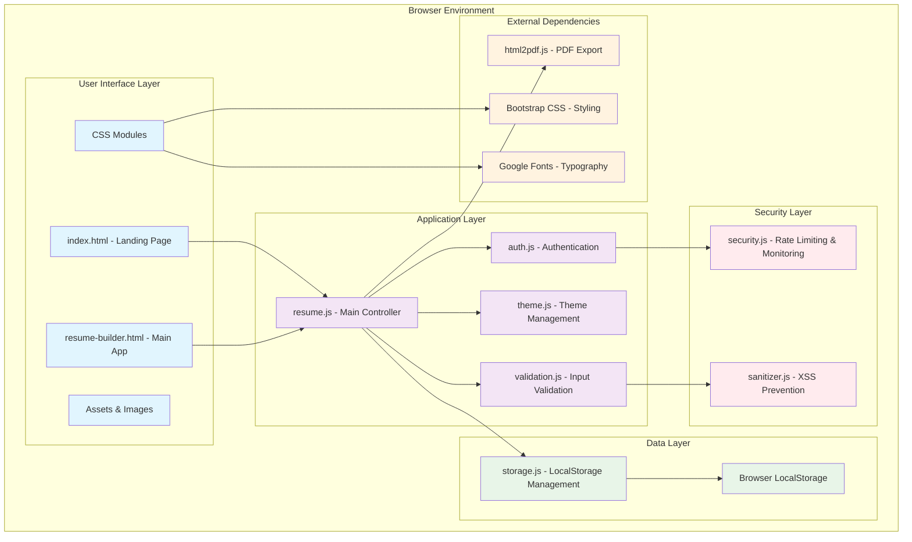
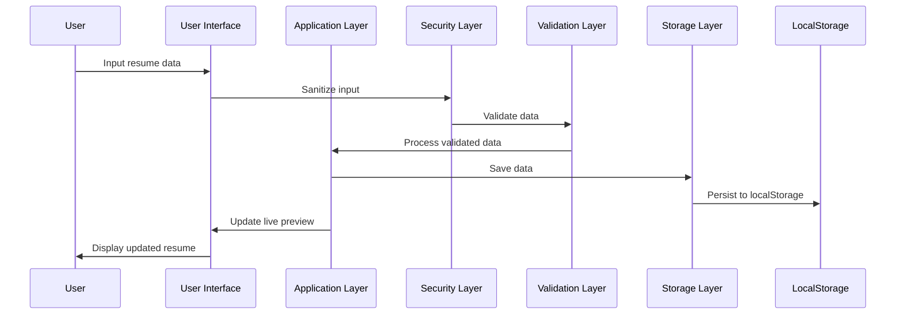

# Resume Builder - System Architecture

## 🏗️ Overview

The Resume Builder is a **frontend-only web application** built with vanilla HTML, CSS, and JavaScript. It follows a modular architecture with clear separation of concerns and no backend dependencies.

## 🎯 Design Principles

- **Privacy First**: All data stays in the browser (localStorage)
- **Framework-Free**: Pure vanilla JavaScript for lightweight performance
- **Modular Design**: Separate modules for different concerns
- **Progressive Enhancement**: Works without JavaScript for basic functionality
- **Responsive Design**: Mobile-first approach with desktop enhancements

## 📊 System Architecture Diagram



## 🔧 Module Architecture

### Core Modules

#### 1. **Application Controller** (`resume.js`)
- **Purpose**: Main application logic and coordination
- **Responsibilities**:
  - Form handling and data binding
  - Live preview updates
  - Template management
  - PDF export coordination
  - User interaction handling

#### 2. **Authentication Module** (`auth.js`)
- **Purpose**: User authentication and session management
- **Responsibilities**:
  - Login/registration forms
  - Session persistence
  - User state management
  - Security integration

#### 3. **Storage Module** (`storage.js`)
- **Purpose**: Data persistence and retrieval
- **Responsibilities**:
  - LocalStorage operations
  - User data serialization
  - Data validation and cleanup
  - Error handling for storage issues

#### 4. **Validation Module** (`validation.js`)
- **Purpose**: Input validation and data integrity
- **Responsibilities**:
  - Email format validation
  - Phone number validation
  - URL validation with security checks
  - Password strength validation

### Security Modules

#### 5. **Security Module** (`security.js`)
- **Purpose**: Application security and monitoring
- **Responsibilities**:
  - Rate limiting for authentication
  - Security event logging
  - Client fingerprinting
  - Password strength validation
  - Security statistics

#### 6. **Sanitizer Module** (`sanitizer.js`)
- **Purpose**: Input sanitization and XSS prevention
- **Responsibilities**:
  - HTML escaping
  - URL validation and sanitization
  - Form input sanitization
  - File name sanitization

### UI Modules

#### 7. **Theme Module** (`theme.js`)
- **Purpose**: Theme management and user preferences
- **Responsibilities**:
  - Light/dark mode toggle
  - Theme persistence
  - CSS variable management
  - Accessibility considerations

## 📊 Data Flow Architecture



## 🔄 Component Interaction Flow

### 1. **Application Startup**
```
index.html → Load CSS/JS → Initialize modules → Check authentication → Show appropriate view
```

### 2. **User Authentication**
```
Login form → Security check → Validation → Storage → Session creation → Redirect to app
```

### 3. **Resume Creation**
```
Form input → Sanitization → Validation → Live preview update → Auto-save to storage
```

### 4. **PDF Export**
```
Export button → Gather data → Generate PDF (html2pdf.js) → Download to user
```

## 🏛️ Architectural Patterns

### 1. **Module Pattern**
- Each JavaScript file uses IIFE (Immediately Invoked Function Expression)
- Exposes only necessary public APIs
- Prevents global namespace pollution

```javascript
const ModuleName = (() => {
  // Private variables and functions
  const privateVar = 'hidden';
  
  const privateFunction = () => {
    // Internal logic
  };
  
  // Public API
  return {
    publicMethod: () => {
      // Exposed functionality
    }
  };
})();
```

### 2. **Observer Pattern**
- Event-driven communication between modules
- DOM events for user interactions
- Custom events for module communication

### 3. **Strategy Pattern**
- Different validation strategies for different input types
- Multiple sanitization strategies based on content type
- Theme switching strategies

## 💾 Data Architecture

### Storage Strategy
```
User Data Structure:
{
  email: "user@example.com",
  profile: {
    fullname: "John Doe",
    email: "user@example.com"
  },
  resume: {
    personalInfo: { ... },
    experience: [ ... ],
    education: [ ... ],
    skills: [ ... ]
  },
  preferences: {
    theme: "light|dark",
    template: "modern|classic"
  },
  session: boolean,
  lastModified: timestamp
}
```

### Security Data Structure
```
Security Data:
{
  loginAttempts: {
    clientId: [
      { timestamp, email, reason }
    ]
  },
  blockedClients: {
    clientId: {
      blockedAt: timestamp,
      reason: string,
      attempts: number
    }
  },
  securityLog: [
    { timestamp, event, details, severity, clientId }
  ]
}
```

## � Security Architecture

### Defense in Depth
1. **Input Layer**: Sanitization and validation
2. **Application Layer**: Rate limiting and monitoring
3. **Storage Layer**: Data encryption and validation
4. **Transport Layer**: HTTPS enforcement (deployment)
5. **Browser Layer**: CSP headers and security policies

### Security Flow
```
User Input → Sanitization → Validation → Rate Limiting → Processing → Secure Storage
```

## 🎨 UI Architecture

### Responsive Design Strategy
```
Mobile First (320px+) → Tablet (768px+) → Desktop (1024px+) → Large Desktop (1440px+)
```

### CSS Architecture
- **CSS Variables**: For theming and consistency
- **BEM Methodology**: For maintainable CSS classes
- **Mobile-First**: Progressive enhancement approach
- **Component-Based**: Modular CSS for reusability

## 🚀 Performance Architecture

### Optimization Strategies
1. **Lazy Loading**: Load modules only when needed
2. **Debouncing**: Prevent excessive API calls during typing
3. **Caching**: Cache DOM queries and computed values
4. **Minification**: Compress CSS and JavaScript for production
5. **CDN Usage**: External libraries from reliable CDNs

### Performance Metrics
- **First Contentful Paint**: < 1.5s
- **Time to Interactive**: < 3s
- **Bundle Size**: < 100KB (excluding external libraries)
- **Memory Usage**: < 50MB peak

## 🧪 Testing Architecture

### Test Strategy
```
Unit Tests → Integration Tests → Security Tests → E2E Tests → Performance Tests
```

### Test Coverage
- **Unit Tests**: Individual module functionality
- **Integration Tests**: Module interaction
- **Security Tests**: Vulnerability testing
- **UI Tests**: User interaction flows
- **Performance Tests**: Load and stress testing

## 📱 Deployment Architecture

### Static Hosting Options
1. **Vercel** (Current): Automatic deployments from Git
2. **Netlify**: Alternative with similar features
3. **GitHub Pages**: Simple static hosting
4. **Self-Hosted**: Apache/Nginx with proper security headers

### Deployment Flow
```
Git Push → CI/CD Pipeline → Build Process → Security Checks → Deploy to CDN
```

## 🔄 Scalability Considerations

### Current Limitations
- **Client-Side Only**: No server-side processing
- **LocalStorage Limits**: ~5-10MB per domain
- **No Real-Time Sync**: Single-device usage

### Future Scalability Options
1. **Backend Integration**: Optional server-side features
2. **Cloud Storage**: Sync across devices
3. **Real-Time Collaboration**: Multiple users on same resume
4. **Advanced Analytics**: Usage tracking and insights

## �️ Development Architecture

### Development Workflow
```
Feature Branch → Development → Testing → Code Review → Merge → Deploy
```

### Code Organization
```
├── /                          # Root directory
├── *.html                     # HTML pages
├── *.js                       # JavaScript modules
├── /css/                      # Stylesheets
├── /images/                   # Static assets
├── /tests/                    # Test files
├── /docs/                     # Documentation
└── /assets/                   # Favicon and branding
```

## � Quality Assurance

### Code Quality Standards
- **ESLint**: JavaScript linting and formatting
- **JSDoc**: Comprehensive code documentation
- **Jest**: Unit and integration testing
- **Lighthouse**: Performance and accessibility auditing

### Security Standards
- **OWASP Compliance**: Protection against top 10 vulnerabilities
- **CSP Implementation**: Content Security Policy headers
- **Input Validation**: All user inputs sanitized and validated
- **Rate Limiting**: Protection against brute force attacks

## 🔮 Future Architecture Evolution

### Planned Enhancements
1. **Microservices**: Optional backend services
2. **PWA Features**: Offline functionality and app-like experience
3. **WebAssembly**: Performance-critical operations
4. **Web Components**: Reusable UI components
5. **GraphQL**: Efficient data fetching (if backend added)

---

This architecture provides a solid foundation for the Resume Builder while maintaining simplicity, security, and scalability. The modular design allows for easy maintenance and future enhancements while keeping the core functionality lightweight and performant.